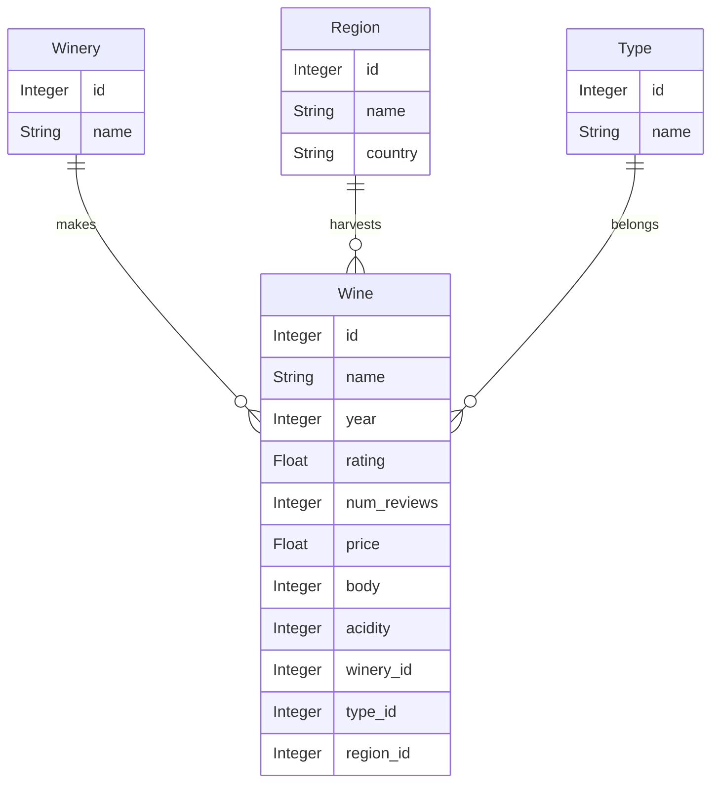

# WineShop 🍷
In this repo you will find a fictionial project for educational porpouses.
## Client Specifications
 Normalize the given dataset wines_SPA.csv

* Build a RESTful API around the model implementing entity lists and all CRUD operations:

    * `/api/wine/{id}`
    * `/api/winery/{id}`
    * `/api/region/{id}`
    * `/api/type/{id}`

* Create unit tests.

* Create functional tests.

* Implement basic authentication.

(Data attribution: [fedesoriano](https://www.kaggle.com/fedesoriano))

### Wine recommendations

* Data validation
  * All fields must be obligatory when creating entries
  * Catalog names cannot be empty
  * Body and Acidity must be in 1-5 range
  * Years must be in range 1900-current year
  * Price, rating and number of reviews cannot be negative
  * Rating must be in the 0-5 range

* Provide a set of recommendations using the following endpoints, complying with the attached OpenAPI specification.    

  * `/api/recommend/best?top=10`
    Best rated wines overall

  * `/api/recommend/expensive?top=10`
    Pricier wines

  * `/api/recommend/bang?top=10`
    Best bang for the buck: best rating-to-price ratios

  * `/api/recommend/vintage?top=10`
    Best vintage: Years with best rated wines (include list of wines for these years)

* Authentication
  * Unauthenticated reads
  * Writes and deletions require basic authentication
  * Assign users to different roles
  * Create and Update require the USER role
  * Deletions require the ADMIN role

* Non-functional requirements
  * Expose observability endpoints under `/manage`
    * Application health
      * Application up
      * Disk space
      * Database connection
    * Metrics
      * Keep track of number of requests
    * Endpoints
      * Show a list of all configured endpoints
